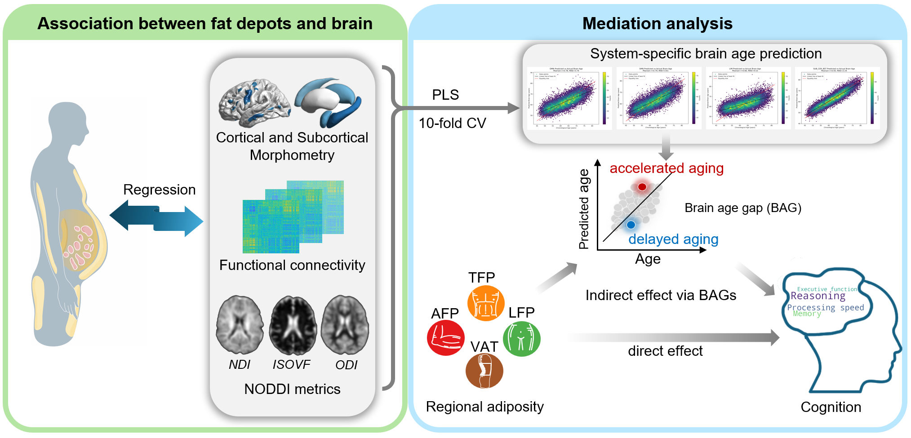

# Regional Adiposity Shapes Brain and Cognition in Adults 

This repository contains the code used for the major analyses in **MATLAB (R2017b; The MathWorks, Inc., USA), and R (version 4.3.1)**.    

## Overview

The study investigated the associations between regional adiposity measures and brain morphology, function connectivity, white matter microstructure and cognition performance, using:  
1. **Linear regression models**
2. **Mediation analysis**
  

## Repository Structure

<pre>
├── scripts/
│   ├── 01_Two_step_cortical_demo.m    
│   ├── 02_mediation_analysis.R    
├── data/
│   └── example_data.csv
└── README.md      
</pre>

> ⚠️ The data in `example_data.csv` is simulated for illustration only.    
> It does **not** reflect real distributions, and the number/type of covariates is simplified.  
> For full methodological details, please refer to the published paper.  


## Analysis Pipeline 

### 1. Data Preparation  
- Import and clean raw dataset (`example_data.csv`).
- Calculate regional adiposity measures: arm fat, leg fat, trunk fat, VAT, and BMI.
- Merge demographic and lifestyle covariates: age, sex, education, employment, smoking, alcohol, physical activity, metabolic health, etc.
- Precompute cortical metrics (thickness, volume, area) using FreeSurfer; load them using SurfStat.
- Similar pipelines were applied to other modalities (e.g., subcortical volumes, functional connectivity, NODDI metrics VBM analysis using SPM12 ).  
- Below we illustrate the analysis using **cortical morphology** as an example.  

---

### 2. Two-Step Regression Analysis   

For each brain metric (e.g., thickness, volume, or other modality) and each adiposity measure:  

**Step 1: Eliminate BMI masking effect**  

We first remove the influence of overall obesity (BMI) from the brain metric, producing residual values:  

**Model 1**:  
- Brain_Metric = β₀ + β₁ * BMI + ε  
- **Get residuals (BMI-adjusted brain metric)**: Residuals = Brain_Metric - predicted(Brain_Metric)

<br>
**Step 2: Test independent effect of regional adiposity** 

**Model 2**:  
- Residuals = γ₀ + γ₁ * Regional_Adiposity  
                    + γ₂ * Age  
                    + γ₃ * Sex  
                    + γ₄ * Education
                    + γ₅ * Smoking
                    + ... + η  

---

**Standardized Beta Coefficient**  

To make effect sizes comparable across regions and predictors,  
we computed standardized beta values from the raw regression coefficients:  

```
# Standardized β (for regional adiposity predictor)
beta_standardized = (beta_raw * std(X)) / std(Y)

# In this context:
#     X = Regional_Adiposity
#     Y = Residuals from Step 1 (i.e., brain metric adjusted for BMI)
```
